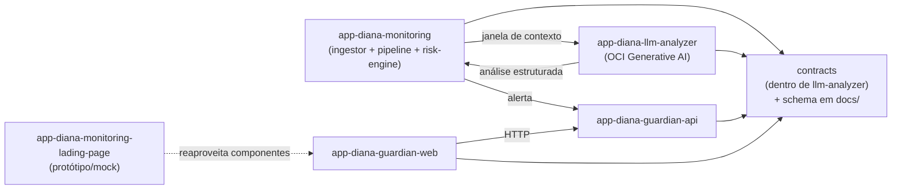

# 01 — Divisão de Repositórios

> Como a DIANA se divide em repositórios no MVP, por que reduzimos de 8 para **5 repositórios** e por
> que as duas junções realizadas são **efetivas e funcionais**.

← [Voltar ao índice](README.md)

---

## Princípio da divisão

Cada repositório corresponde a uma **responsabilidade única e deployável**. A divisão segue os quatro
eixos que o produto exige — **background**, **Telegram**, **LLM** e **tela do responsável** — mais o
protótipo/landing já existente e um contrato de domínio compartilhado.

Uma divisão "purista" chegaria a 8 repositórios (ingestor, pipeline, risk-engine, contracts, llm,
guardian-api, guardian-web + landing). Para um MVP, isso é overhead sem retorno. Aplicamos **duas
junções** que reduzem para **5 repositórios** sem perder capacidade de evolução.

---

## Os 5 repositórios

| # | Repositório | Estado | Responsabilidade | Stack sugerida |
| --- | --- | --- | --- | --- |
| 1 | `app-diana-monitoring-lading-page` | existe | Landing + protótipo/demo interativo (pipeline mock, componentes guardian, simulação do celular) | Vite + React + TS |
| 2 | `app-diana-monitoring` | existe | **Núcleo de background**: `ingestor` (Telegram) + `pipeline` + `risk-engine`. Também hospeda a pasta `docs/` compartilhada | Node + TS |
| 3 | `app-diana-llm-analyzer` | a criar | **Inteligência**: gateway para **OCI Generative AI** + módulo **`contracts`** (tipos de domínio) | Node + TS (ou Python) |
| 4 | `app-diana-guardian-api` | a criar | **API do responsável**: alertas, detalhe, feedback, settings (sem auth no MVP) | Node + TS |
| 5 | `app-diana-guardian-web` | a criar | **App web mobile do responsável** (reaproveita `src/components/guardian/*` da landing) | Vite + React + TS |

> **Escopo desta entrega:** apenas a documentação (esta pasta). A criação dos 3 repositórios novos e o
> código dos serviços são fases posteriores — ver [`07-roadmap.md`](07-roadmap.md).

---

## Análise das junções (8 → 5)

### Junção 1 — `app-diana-monitoring` = **telegram-ingestor + pipeline + risk-engine**

**Veredito: ✅ efetiva e recomendada para o MVP.**

**Por quê funciona:**

- **Fluxo contínuo único.** Ingestor → pipeline → risk-engine formam um só caminho de dados
  (captura → batch → análise → risco). Separá-los criaria transporte entre serviços (fila, serialização,
  rede) sem benefício em um MVP de baixo volume.
- **Domínio compartilhado.** Todos operam sobre a mesma entidade `Conversation`/`ConversationMessage`.
- **Volume baixo.** No MVP a maioria dos dados é mock e as ações reais do Telegram são ocasionais — um
  único processo dá conta com folga.
- **Um só deployável.** Uma única *Container Instance* na OCI, um só agendamento de 2h, um só ciclo de deploy.

**Como fica organizado internamente (para poder separar depois):**

```text
app-diana-monitoring/
├── docs/                    # pasta compartilhada (fonte única)
├── src/
│   ├── ingestor/            # Telegram Bot API + checkpoint  → doc 03
│   ├── pipeline/            # normaliza→compacta→particiona→(cripto)→context engine→reconstrói  → doc 02
│   ├── risk-engine/         # consolida sinais em score/prioridade (porta riskEngine.ts + thresholds.ts)
│   ├── state/               # máquina de estados da análise (checkpoint, status)
│   └── scheduler/           # gatilho de 2h
└── README.md                # aponta para docs/
```

Se no futuro o volume crescer, cada pasta `src/*` já é um módulo com fronteira clara e pode virar um
serviço próprio **sem reescrita** — só extração.

---

### Junção 2 — `app-diana-llm-analyzer` = **llm-analyzer + contracts**

**Veredito: ✅ funciona, com uma ressalva que resolvemos.**

**Por quê faz sentido:** o llm-analyzer é o **produtor natural do contrato de análise**. A interface
`RiskAnalyzer` é, literalmente, "o que o analisador implementa", e o `AnalysisResult` é a saída dele.
Sediar o contrato ali é coerente.

**A ressalva:** o contrato **também** é consumido por `app-diana-monitoring` (que monta a `Conversation`)
e pelo `guardian` (que consome o `Alert`). Se os tipos ficassem *presos* dentro do llm-analyzer, esses
repositórios passariam a **depender do repo da LLM só para pegar tipos** — uma direção de dependência
ruim (o núcleo dependendo da periferia + arrastar o SDK da OCI só por tipos).

**Como resolvemos (mantendo a junção):**

1. O contrato vive como um **módulo sem dependências** dentro do llm-analyzer:

   ```text
   app-diana-llm-analyzer/
   ├── contracts/           # SÓ tipos + JSON Schema. ZERO dependência de runtime (sem SDK da OCI).
   │   ├── types.ts         # portado de app-diana-monitoring-lading-page/src/ml/types.ts
   │   └── schema/*.json    # JSON Schema gerado a partir dos tipos
   ├── src/                 # gateway OCI Generative AI (implementa RiskAnalyzer)
   └── package.json         # publica @diana/contracts a partir de contracts/
   ```

2. O **schema canônico** é **espelhado nesta pasta `docs/`** (ver [`contracts.md`](contracts.md)), que é a
   fonte única de verdade.
3. Consumidores usam **o schema** (ou o pacote `@diana/contracts`) — **sem** puxar o runtime da LLM.

Assim a junção reduz um repositório **sem** introduzir acoplamento indevido.

---

## Grafo de dependências



Regra de ouro: **as setas de dependência de tipos apontam todas para `contracts`**, e `contracts` não
depende de ninguém. O núcleo (`monitoring`) nunca depende do runtime da LLM — só do contrato.

---

## Postura mock-first

No MVP, **a fonte padrão de dados é mock** e o caminho real do Telegram é a exceção:

- **Modo mock (padrão):** `app-diana-monitoring` consome cenários (equivalente a
  `app-diana-monitoring-lading-page/src/data/scenarios.ts`, convertidos por `adapter.ts` em `Conversation`)
  e roda a pipeline ponta a ponta. Serve para demonstrar o fluxo completo sem depender de dados reais.
- **Modo real (ocasional):** quando o bot do Telegram recebe uma mensagem em um grupo de teste, o
  ingestor a normaliza e a injeta **no mesmo fluxo**. Nada muda a jusante — a pipeline, a LLM e o
  guardian tratam mock e real de forma idêntica, porque ambos são `Conversation`.

Essa uniformidade é possível porque o **contrato** (`Conversation` → `AnalysisResult`) é o mesmo nos dois
modos. Ver [`contracts.md`](contracts.md).

---

← [Índice](README.md) · [Próximo: 02 — Pipeline / Background →](02-pipeline-background.md)
