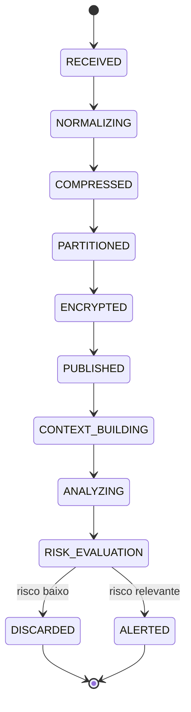
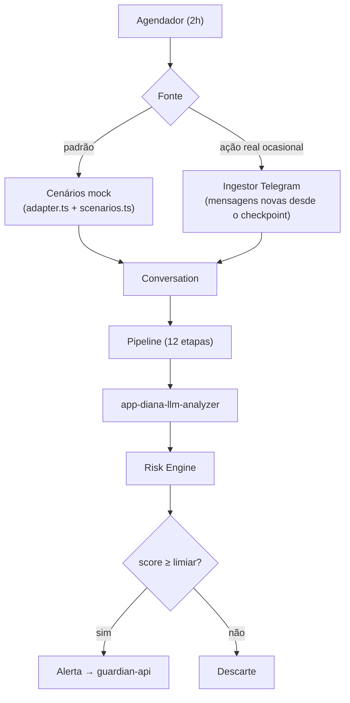

# 02 — Pipeline / O que roda em background

> O coração da DIANA que roda sem interface: captura periódica, proteção, reconstrução de contexto e
> consolidação de risco. Tudo dentro do repositório **`app-diana-monitoring`**.

← [Índice](README.md) · [Anterior: 01 — Repositórios](01-repositorios.md)

---

## Onde roda

Um **único serviço de background** (`app-diana-monitoring`) que reúne três módulos internos:

```text
ingestor  →  pipeline  →  risk-engine
(doc 03)     (este doc)    (consolidação)
```

Deploy: **uma Container Instance na OCI**, acionada por um **agendamento de 2 horas**. Sem broker de
eventos, sem Kubernetes, sem fila externa no MVP — ver [`06-mapeamento-oci.md`](06-mapeamento-oci.md).

---

## Cadência: batch de 2h e janela de ~6h

A configuração inicial (ajustável por variável de ambiente):

```text
BATCH  = 2h        # a cada 2 horas, agrupa e processa o que é novo
N      = 3         # recupera as últimas 3 partições
WINDOW = N × BATCH = 6h   # janela de contexto reconstruída para análise
```

```text
00:00 ─────── 02:00        04:00 ─────── 06:00
   partição P1                 partição P3
        02:00 ─────── 04:00
           partição P2

Janela analisada agora:  [ P1 | P2 | P3 ]  = 00:00 ───────────── 06:00
```

> A visão funcional original usava batch de 4h / janela de 12h. Para o MVP reduzimos para **2h / ~6h**.
> A arquitetura **não** depende desses números: `BATCH` e `N` são configuráveis e a janela pode crescer
> (6 partições ≈ 12h, etc.) sem mudança estrutural.

---

## O pipeline conceitual (12 etapas)

A ordem é a da visão funcional. A referência de implementação já existe, em forma **mock**, no protótipo
(`app-diana-monitoring-lading-page/src/ml/`). O MVP porta esses módulos e troca só a fonte de dados e o
analisador.

```text
CAPTURA            → ingestor (doc 03)
   ↓
NORMALIZAÇÃO       → padroniza IDs, timestamps, participantes, ordem
   ↓
COMPACTAÇÃO        → comprime ANTES de criptografar
   ↓
PARTICIONAMENTO    → divide por intervalo temporal (P1, P2, P3…)
   ↓
CRIPTOGRAFIA*      → protege a partição (MVP: leve/placeholder; hardening depois)
   ↓
PUBLICAÇÃO         → marca "batch pronto" → dispara o processamento
   ↓
RECUPERAÇÃO        → pega as últimas N=3 partições
   ↓
DESCRIPTOGRAFIA*   → em memória
   ↓
DESCOMPRESSÃO      → em memória
   ↓
RECONSTRUÇÃO       → reordena cronologicamente → janela de ~6h (Conversation)
   ↓
ANÁLISE (LLM)      → app-diana-llm-analyzer (doc 04)
   ↓
RISK ENGINE        → consolida sinais em score/prioridade → ALERTA ou DESCARTE
```

\* **Criptografia no MVP:** para manter a arquitetura simples, a etapa existe como *placeholder*
(ex.: chave simétrica local / campo marcado como "protegido") e o **hardening completo com OCI Vault/KMS
fica para o roadmap**. O que **não** muda é o princípio de **plaintext efêmero** (abaixo).

### Mapa etapa → módulo do protótipo (reuso)

| Etapa | Módulo de referência (protótipo) |
| --- | --- |
| Normalização + PII/pseudonimização | `src/ml/preprocess.ts` |
| Extração de características | `src/ml/featureExtractor.ts` |
| Análise (mock hoje, LLM no MVP) | `src/ml/mockAnalyzer.ts` → substituído por `app-diana-llm-analyzer` |
| Análise contextual | `src/ml/contextualAnalyzer.ts` |
| Risk Engine | `src/ml/riskEngine.ts` + `src/ml/thresholds.ts` |
| Explicabilidade | `src/ml/explainability.ts` |
| Orquestração | `src/ml/pipeline.ts` |
| Fonte de dados (cenário → Conversation) | `src/ml/adapter.ts` + `src/data/scenarios.ts` |

---

## Plaintext efêmero (princípio congelado)

Mesmo com criptografia simplificada no MVP, o dado bruto **só existe em texto aberto em memória, durante
a análise**, e é descartado em seguida:

```text
PARTIÇÃO PROTEGIDA
   ↓ (descriptografa/descomprime em memória)
JANELA DE CONTEXTO (~6h)  ── analisada pela LLM ──▶  RESULTADO ESTRUTURADO
   ↓
DESCARTE DO PLAINTEXT
```

Nada persiste a conversa em claro. O que sobra é o `AnalysisResult` (sinais, score, explicação) — não o
conteúdo bruto. Ver [`contracts.md`](contracts.md) e [`05-experiencia-responsavel.md`](05-experiencia-responsavel.md).

---

## Checkpoint (evita duplicação e perda)

O serviço registra até qual mensagem já processou, por conversa:

```json
{
  "conversation_id": "CONV-019",
  "last_message_id": "MSG-1291",
  "period_start": "2026-09-13T08:00:00Z",
  "period_end":   "2026-09-13T10:00:00Z",
  "message_count": 12,
  "status": "ready"
}
```

Regra: **capturar somente o que ainda não foi processado** (a partir de `last_message_id`). Isso evita
duplicação, perda e reprocessamento. No modo mock, o "novo" é simulado; no modo real, vem do offset do
Telegram (ver [`03-telegram-captura.md`](03-telegram-captura.md)).

Persistência do checkpoint no MVP: um pequeno arquivo de estado em **OCI Object Storage** (JSON), sem
banco gerenciado.

---

## Máquina de estados da análise

Cada análise percorre estados bem definidos — útil para saber onde uma eventual falha ocorreu:



O `AnalysisResult` já carrega uma trilha de auditoria (`audit: AuditEntry[]`) com carimbo de tempo por
etapa — ver o tipo em [`contracts.md`](contracts.md).

---

## Modo mock (padrão) × modo real (ocasional)



Ponto-chave: **mock e real produzem o mesmo tipo `Conversation`**, então tudo a jusante é idêntico.
Trocar/mesclar fontes é só configuração.

---

## Requisitos funcionais cobertos aqui

RF-01 (captura periódica 2h), RF-02 (checkpoint), RF-03 (batch), RF-04 (normalização), RF-05 (compressão),
RF-06 (particionamento), RF-07 (criptografia — simplificada no MVP), RF-08 (processamento assíncrono —
agendado no MVP), RF-09 (recuperação de N=3 partições), RF-10 (reconstrução), RF-13 (Risk Engine).
Rastreabilidade completa em [`07-roadmap.md`](07-roadmap.md).

---

← [Índice](README.md) · [Próximo: 03 — Telegram →](03-telegram-captura.md)
