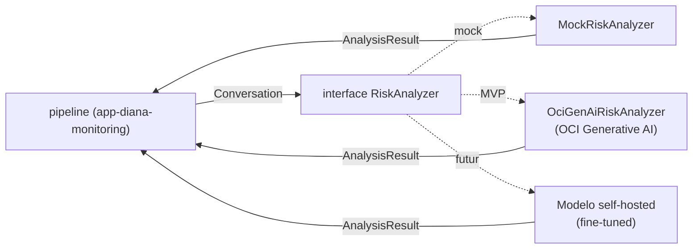

# 04 — Inteligência / Como a LLM funciona

> O repositório **`app-diana-llm-analyzer`**: recebe a janela de contexto reconstruída e devolve uma
> **interpretação estruturada** (sinais, categorias, confiança, explicação). Usa **OCI Generative AI** e
> hospeda o módulo **`contracts`**.

← [Índice](README.md) · [Anterior: 03 — Telegram](03-telegram-captura.md)

---

## Princípio: a LLM **interpreta**, o Risk Engine **consolida**

Essa separação é fundamental e **congelada**:

| Componente | Responsabilidade | Onde vive |
| --- | --- | --- |
| **LLM** | Interpretar contexto → produzir *indicadores*, categorias possíveis, confiança e explicação | `app-diana-llm-analyzer` |
| **Risk Engine** | Transformar evidências em risco consistente (frequência, sequência, escalada, combinação, severidade, confiança) → score/prioridade | módulo `risk-engine` em `app-diana-monitoring` |

A LLM **não decide o score final** e **não emite acusações**. Ela diz, por exemplo, *"padrões compatíveis
com possível grooming"*, e o Risk Engine determinístico consolida. Isso evita depender de uma única decisão
probabilística da LLM.

---

## A fronteira de troca: interface `RiskAnalyzer`

O protótipo já define o ponto exato de substituição do mock pelo modelo real:

```ts
// contrato (ver contracts.md)
export interface RiskAnalyzer {
  analyzeConversation(conversation: Conversation): Promise<AnalysisResult>;
}
```

- Hoje (protótipo): `MockRiskAnalyzer` implementa essa interface.
- No MVP: `app-diana-llm-analyzer` fornece um `OciGenAiRiskAnalyzer` que implementa a **mesma** interface.
- O núcleo (`app-diana-monitoring`) depende **apenas da interface** — trocar mock ↔ OCI GenAI ↔ modelo
  self-hosted futuro **não** altera o resto do sistema.



---

## OCI Generative AI (serviço gerenciado)

**Escolha do MVP:** **OCI Generative AI**, o serviço gerenciado da Oracle.

- **Dados permanecem na região da OCI** — sem operar GPU, sem enviar dados de crianças para fora da nuvem
  do projeto (coerente com privacy by design).
- **Rápido de começar** e fácil de trocar depois por um modelo aberto self-hosted (via a mesma interface
  `RiskAnalyzer`), se/quando houver necessidade de fine-tuning ou controle total.

O `app-diana-llm-analyzer` é um **gateway fino**: monta o prompt, chama o OCI Generative AI com **saída
estruturada (JSON schema)**, valida a resposta contra o contrato e a devolve.

---

## Entrada da LLM

A LLM **não** recebe uma mensagem isolada. Recebe a **janela de contexto reconstruída (~6h)** mais
metadados:

```text
janela de contexto (Conversation ordenada por tempo)
        +
metadados temporais (início/fim da janela, nº de partições, escalada observada)
        +
instruções + taxonomia de indicadores
```

Exemplo do que a LLM "vê":

```text
[00:10] Criança: Oi
[00:42] Outro: Quantos anos você tem?
[01:05] Criança: 13
[03:10] Outro: Não precisa contar tudo para seus pais
[05:22] Outro: Qual escola você estuda?
[hh:mm] Outro: Me manda uma foto sua
```

A LLM deve procurar a **progressão** (age_probing → rapport → secrecy → isolation → personal_info →
image_request), não só a palavra "foto".

---

## Saída da LLM: estruturada e por taxonomia

A LLM devolve **JSON validado por schema**, com indicadores intermediários (não só a categoria final).
Taxonomia (subconjunto — ver visão funcional §33):

| Pilar | Indicadores |
| --- | --- |
| **Grooming** | `age_probing`, `rapport_building`, `secrecy_request`, `isolation_attempt`, `image_request`, `intimate_content_request`, `meeting_request`, `platform_migration`, `coercion`, `threat` |
| **Cyberbullying** | `insult`, `humiliation`, `threat`, `repetition`, `targeting`, `exclusion`, `denigration`, `identity_attack`, `doxxing` |
| **Captura de informação pessoal** | `name_request`, `school_request`, `address_request`, `phone_request`, `location_request`, `routine_request`, `parent_information_request`, `password_request`, `identity_document_request`, `financial_information_request` |

Forma da resposta (compatível com `DetectedSignal[]` + insumos para o `AnalysisResult` — ver
[`contracts.md`](contracts.md)):

```json
{
  "signals": [
    { "type": "secrecy_request", "confidence": 0.67, "messageIds": ["MSG-31","MSG-40"],
      "severity": "high", "rationale": "pediu para não contar aos pais" },
    { "type": "image_request", "confidence": 0.60, "messageIds": ["MSG-58"],
      "severity": "high", "rationale": "solicitou foto pessoal" }
  ],
  "categories": [
    { "category": "grooming", "probability": 0.90 },
    { "category": "personal_information", "probability": 0.48 }
  ],
  "progression": "escalada de comportamento comum para invasivo ao longo da janela",
  "confidence": 0.7
}
```

O Risk Engine então consolida `signals`/`categories` + frequência/sequência/escalada em `score`,
`priority` e `requiresGuardianAttention`.

---

## Robustez do gateway (MVP)

- **Validação de schema:** se a resposta não bater com o JSON schema, o gateway rejeita/re-tenta; não
  repassa dados malformados à pipeline.
- **Fallback:** se o OCI Generative AI estiver indisponível, o gateway pode cair para o `MockRiskAnalyzer`
  (marcado no `ModelMetadata.environment = "mock"`), garantindo que a demo/MVP nunca trave.
- **Metadados de modelo:** toda análise carrega `ModelMetadata { modelName, version, environment }` para
  rastreabilidade (ex.: distinguir resultado real de fallback mock).

---

## O módulo `contracts` (junção)

`app-diana-llm-analyzer` hospeda o módulo **`contracts/`** — tipos de domínio + JSON Schema, **sem
dependências de runtime** (nada do SDK da OCI). É consumido por todos os repos e tem o schema espelhado
nesta pasta `docs/`. Detalhes e justificativa em [`01-repositorios.md`](01-repositorios.md#junção-2--app-diana-llm-analyzer--llm-analyzer--contracts)
e [`contracts.md`](contracts.md).

---

## Requisitos funcionais cobertos aqui

RF-11 (análise contextual), RF-12 (análise por pilares), RF-14 (explicabilidade). RF-13 (Risk Engine) é
consolidado no núcleo — ver [`02`](02-pipeline-background.md).

---

← [Índice](README.md) · [Próximo: 05 — Responsável →](05-experiencia-responsavel.md)
