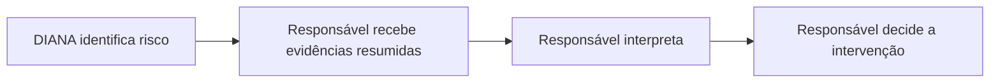
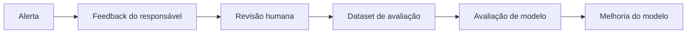

# 05 — Experiência do Responsável

> A "tela do responsável": onde o alerta chega e a decisão humana acontece. Dois repositórios:
> **`app-diana-guardian-web`** (app web mobile) e **`app-diana-guardian-api`** (API que os alertas
> alimentam). **Sem autenticação no MVP.**

← [Índice](README.md) · [Anterior: 04 — LLM](04-llm-inteligencia.md)

---

## Papel do responsável

A DIANA é **apoio à decisão**, não decisão autônoma:



A DIANA **não** substitui o responsável e **não** afirma que um crime ocorreu — apresenta padrões e
evidências para avaliação humana.

---

## O que o responsável **recebe**

Um **alerta estruturado** (nunca a conversa integral):

```text
✓ score            ✓ prioridade        ✓ categoria principal
✓ período          ✓ sinais            ✓ frequência
✓ escalada         ✓ sequência         ✓ combinação de sinais
✓ justificativa    ✓ recomendação de ação
```

Exemplo (baseado na visão funcional §47–49):

```text
Prioridade: Alta        Nível: Alto        Criança: Caio
Detectado: agora        Período: 00:00–06:00

Possível grooming / aliciamento — Risco estimado: 73/100

Categorias:  Grooming 90%  ·  Captura de informação 48%  ·  Cyberbullying 12%

Sinais:
  • Pedido de segredo — Alto (confiança 67%, 2 ocorrências)
  • Solicitação de imagem — Alto (confiança 60%, 1 ocorrência)
  • Tentativa de isolamento — Alto (confiança 60%, 1 ocorrência)

Por quê: combinação de sinais com recorrência e progressão dentro da janela analisada.
```

## O que o responsável **NÃO recebe**

```text
❌ conversa integral      ❌ histórico completo de mensagens
❌ cópia de imagens        ❌ áudio / transcrição integral
❌ conteúdo bruto desnecessário
```

Isso decorre do princípio de **minimização** e do **plaintext efêmero** (ver [`02`](02-pipeline-background.md)):
o guardian só vê o `AnalysisResult` agregado, não a `Conversation`.

---

## `app-diana-guardian-web` — o app

App web mobile que **reaproveita os componentes já prototipados** na landing
(`app-diana-monitoring-lading-page/src/components/guardian/*`):

| Componente | Função |
| --- | --- |
| `AlertsList` | lista de alertas por prioridade |
| `AlertDetail` | detalhe do alerta (score, sinais, fatores contextuais, recomendação) |
| `Dashboard` | visão geral / evolução do risco |
| `Settings` | preferências |
| `SafetyCenter` | orientação/educação preventiva |

Hospedagem no MVP: site estático em **OCI Object Storage** (ou uma Container Instance). Ver
[`06-mapeamento-oci.md`](06-mapeamento-oci.md).

---

## `app-diana-guardian-api` — a API

API HTTP fina que serve o app:

| Rota (conceitual) | Descrição |
| --- | --- |
| `GET /alerts` | lista de alertas (resumo) |
| `GET /alerts/{id}` | detalhe (`AnalysisResult` já resumido para o guardião) |
| `POST /alerts/{id}/feedback` | feedback do responsável (útil, falso positivo…) → alimenta o *feedback loop* |
| `GET /settings` · `PUT /settings` | preferências |

Fonte dos dados no MVP:

- **Majoritariamente mock:** os alertas exibidos vêm em grande parte de resultados mock (demonstração).
- **Real ocasional:** quando a pipeline gera um alerta real (a partir do Telegram), ele entra na mesma
  lista, pelo mesmo formato.

### Sem autenticação no MVP

O guardian-api **não tem camada de autenticação/IAM** neste MVP (decisão explícita para simplificar).
Implicações e mitigação:

- acesso aberto ou protegido por uma **chave simples** / IP restrito, apenas para a demo;
- **não** deve receber dados sensíveis reais de crianças enquanto não houver auth — coerente com a postura
  *mock-first*;
- autenticação (ex.: OIDC via OCI IAM Identity Domains) está no [roadmap](07-roadmap.md) como **pré-requisito
  para sair do MVP** e tratar dados reais de forma recorrente.

---

## Feedback loop (human-in-the-loop)



No MVP o feedback é **coletado** (endpoint acima), mas treinamento automático **não** é implementado —
igual ao que o protótipo já declara em `docs/ml-architecture.md` da landing.

---

## Requisitos funcionais cobertos aqui

RF-15 (gerar alerta ao ultrapassar o limiar) e RF-16 (não expor a conversa integral). Rastreabilidade em
[`07-roadmap.md`](07-roadmap.md).

---

← [Índice](README.md) · [Próximo: 06 — Mapeamento OCI →](06-mapeamento-oci.md)
