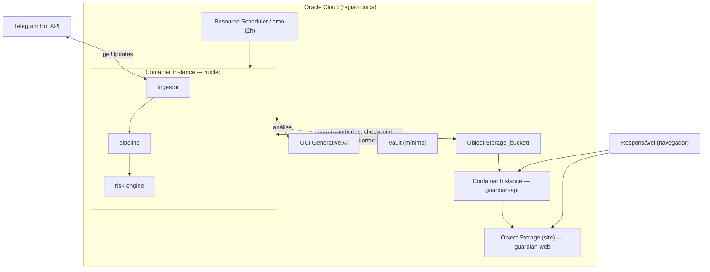

# 06 — Mapeamento para a Oracle Cloud (OCI)

> Onde cada peça roda na OCI, no formato **enxuto** de um MVP. Deliberadamente **sem** rede/VCN,
> observability, autenticação, cache, banco gerenciado, broker ou KMS completo — esses ficam no
> [roadmap](07-roadmap.md).

← [Índice](README.md) · [Anterior: 05 — Responsável](05-experiencia-responsavel.md)

---

## Tabela função → serviço OCI (MVP)

| Função lógica | Serviço OCI (MVP) | Observação |
| --- | --- | --- |
| Execução do núcleo de background (ingestor + pipeline + risk-engine) | **OCI Container Instances** | 1 container simples; sem OKE/Functions |
| Execução do guardian-api | **OCI Container Instances** | 1 container simples |
| Agendamento do batch (2h) | **cron no próprio container** ou **OCI Resource Scheduler** | dispara o processamento |
| Artefatos / partições protegidas | **OCI Object Storage** | 1 bucket; regra de ciclo de vida simples |
| Checkpoint + alertas persistidos | **OCI Object Storage (JSON)** | sem banco gerenciado no MVP |
| Inteligência (LLM) | **OCI Generative AI** | serviço gerenciado, dados na região |
| Segredos (token do bot, chave GenAI) | **OCI Vault (mínimo)** ou **variáveis de ambiente** | ver nota abaixo |
| Frontend do responsável | **OCI Object Storage (site estático)** ou Container Instance | — |
| Registro de imagens de container | **OCI Container Registry (OCIR)** | destino do build |

---

## Topologia de implantação (MVP)



Fluxo em uma frase: o **scheduler** aciona o **container do núcleo** a cada 2h; ele captura (mock ou
Telegram), roda a pipeline, chama a **OCI Generative AI**, consolida o risco, grava alertas no **Object
Storage**; o **guardian-api** lê esses alertas e o **guardian-web** os mostra ao responsável.

---

## O que está **fora** do MVP (e por quê)

| Deixado para depois | Serviço OCI futuro | Por que dá para adiar no MVP |
| --- | --- | --- |
| Rede dedicada / isolamento | VCN, subnets privadas, NAT, WAF | volume baixo, dados mock; sem tráfego sensível recorrente |
| Autenticação / identidade | IAM Identity Domains (OIDC) | guardian sem auth no MVP (ver [`05`](05-experiencia-responsavel.md)) |
| Observability | Logging, Monitoring, APM | logs de container bastam para a demo |
| Cache de contexto | OCI Cache with Redis | janela pequena (~6h), poucas partições |
| Banco de dados | Autonomous DB / PostgreSQL | Object Storage (JSON) atende o estado mínimo |
| Fila / eventos | Streaming (Kafka), Queue, Events | agendamento de 2h dispensa broker |
| Criptografia gerenciada | Vault/KMS + envelope encryption | cripto simplificada + plaintext efêmero no MVP |

> **Importante:** *fora do MVP* não é *fora da arquitetura*. Cada item acima tem um ponto de entrada já
> previsto (a interface `RiskAnalyzer`, o adaptador do Telegram, o bucket de artefatos, o guardian-api),
> de modo que ativá-los depois é **adição**, não reescrita.

---

## Segredos no MVP

Só há um segredo realmente sensível: o **`TELEGRAM_BOT_TOKEN`** (e a credencial do OCI Generative AI,
que idealmente usa *resource principals* do próprio serviço). Recomendação:

- **Preferir OCI Vault** (mesmo que mínimo) para o token do bot; **ou** variável de ambiente da Container
  Instance se a simplicidade for prioridade absoluta na demo.
- Nunca versionar segredos no repositório (`.env` fora do git).

---

## Build & deploy (simples)

```text
GitHub (repo) ──push──▶ build da imagem ──▶ OCIR ──▶ deploy manual/script na Container Instance
```

CI/CD elaborado (OCI DevOps, pipelines) fica para o roadmap; no MVP um script de build+push+deploy basta.

---

← [Índice](README.md) · [Próximo: 07 — Roadmap →](07-roadmap.md)
