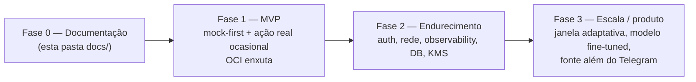

# 07 — Roadmap e Rastreabilidade

> Fases da evolução, rastreabilidade dos requisitos funcionais (RF-01…RF-16) por repositório, e o que
> fica explicitamente para depois do MVP.

← [Índice](README.md) · [Anterior: 06 — Mapeamento OCI](06-mapeamento-oci.md)

---

## Fases

### Fase 0 — Documentação *(entrega atual)*
Esta pasta `docs/`. Define divisão de repositórios, pipeline, Telegram, LLM, experiência do responsável e
mapeamento OCI enxuto.

### Fase 1 — MVP
- Criar os 3 repositórios novos (`llm-analyzer`, `guardian-api`, `guardian-web`).
- Portar os módulos mock de `app-diana-monitoring-lading-page/src/ml/` para `app-diana-monitoring`.
- Implementar o ingestor do Telegram (Bot API) e o modo `mock|real|both`.
- Gateway OCI Generative AI implementando `RiskAnalyzer`.
- guardian-api + guardian-web servindo alertas (mock-first).
- Deploy em Container Instances + Object Storage + agendamento 2h.

### Fase 2 — Endurecimento (sair do MVP)
Pré-requisito para tratar dados reais de forma recorrente:
- **Autenticação** (OCI IAM Identity Domains / OIDC) — ver [`05`](05-experiencia-responsavel.md).
- **Rede** (VCN, subnets privadas, WAF) e **observability** (Logging/Monitoring/APM).
- **Criptografia gerenciada** (OCI Vault/KMS, envelope encryption) — completar o RF-07.
- **Banco** (Autonomous DB/PostgreSQL) e possivelmente **cache** (Redis) e **fila** (Streaming/Queue).

### Fase 3 — Escala / produto
- **Janela adaptativa** (6h → 24h → 48h conforme incerteza/escalada).
- **Modelo fine-tuned** self-hosted (troca via `RiskAnalyzer`, sem afetar consumidores).
- **Fonte além do Telegram** (o ingestor é um adaptador substituível).

---

## Rastreabilidade RF-01…RF-16

Status: ✅ atendido no MVP · 🟡 parcial no MVP · ⏭️ adiado.

| RF | Requisito | Repositório / módulo | Status MVP | Doc |
| --- | --- | --- | --- | --- |
| RF-01 | Captura periódica (**2h** no MVP) | `app-diana-monitoring` · scheduler/ingestor | ✅ | [02](02-pipeline-background.md), [03](03-telegram-captura.md) |
| RF-02 | Checkpoint (última mensagem processada) | `app-diana-monitoring` · ingestor | ✅ | [02](02-pipeline-background.md), [03](03-telegram-captura.md) |
| RF-03 | Batch (agrupar novas mensagens) | `app-diana-monitoring` · pipeline | ✅ | [02](02-pipeline-background.md) |
| RF-04 | Normalização | `app-diana-monitoring` · pipeline (`preprocess.ts`) | ✅ | [02](02-pipeline-background.md), [03](03-telegram-captura.md) |
| RF-05 | Compressão (antes da cripto) | `app-diana-monitoring` · pipeline | ✅ | [02](02-pipeline-background.md) |
| RF-06 | Particionamento temporal | `app-diana-monitoring` · pipeline | ✅ | [02](02-pipeline-background.md) |
| RF-07 | Criptografia das partições | `app-diana-monitoring` · pipeline | 🟡 placeholder; KMS na Fase 2 | [02](02-pipeline-background.md), [06](06-mapeamento-oci.md) |
| RF-08 | Processamento assíncrono | `app-diana-monitoring` · scheduler | ✅ agendado (sem broker) | [02](02-pipeline-background.md), [06](06-mapeamento-oci.md) |
| RF-09 | Recuperação de contexto (**N=3**) | `app-diana-monitoring` · context engine | ✅ | [02](02-pipeline-background.md) |
| RF-10 | Reconstrução (ordem + timestamps) | `app-diana-monitoring` · pipeline | ✅ | [02](02-pipeline-background.md) |
| RF-11 | Análise contextual pela IA | `app-diana-llm-analyzer` | ✅ | [04](04-llm-inteligencia.md) |
| RF-12 | Análise por pilares | `app-diana-llm-analyzer` | ✅ | [04](04-llm-inteligencia.md) |
| RF-13 | Risk Engine (consolidação) | `app-diana-monitoring` · risk-engine (`riskEngine.ts`) | ✅ | [02](02-pipeline-background.md), [04](04-llm-inteligencia.md) |
| RF-14 | Explicabilidade | `app-diana-llm-analyzer` + risk-engine (`explainability.ts`) | ✅ | [04](04-llm-inteligencia.md) |
| RF-15 | Alerta ao ultrapassar o limiar | `app-diana-monitoring` → `app-diana-guardian-api` | ✅ | [05](05-experiencia-responsavel.md) |
| RF-16 | Privacidade (não expor conversa integral) | `app-diana-guardian-*` | ✅ | [05](05-experiencia-responsavel.md) |

---

## Requisitos não funcionais no MVP

| RNF | Postura no MVP |
| --- | --- |
| Segurança | Simplificada; segredo do bot fora do código; hardening na Fase 2 |
| Privacidade | Princípios congelados ativos (minimização, plaintext efêmero, resumo ao responsável); auditoria completa depois |
| Explicabilidade | ✅ desde o MVP (sinais + fatores + justificativa) |
| Auditabilidade | Trilha `audit[]` no `AnalysisResult`; logs de container |
| Escalabilidade | Janela/partições configuráveis; módulos separáveis; janela adaptativa na Fase 3 |
| Resiliência | Fallback do gateway LLM para mock; checkpoint evita perda/duplicação |

---

## Próximos documentos (após esta visão)

Seguindo a sequência recomendada pela visão funcional (§64), os próximos documentos seriam **ADRs**
(Architecture Decision Records) por bloco: modelo de dados definitivo, contratos de API, contrato da LLM,
contrato do Risk Engine, política de segurança e o mapeamento OCI detalhado da Fase 2.

---

← [Índice](README.md) · [Contrato compartilhado →](contracts.md)
