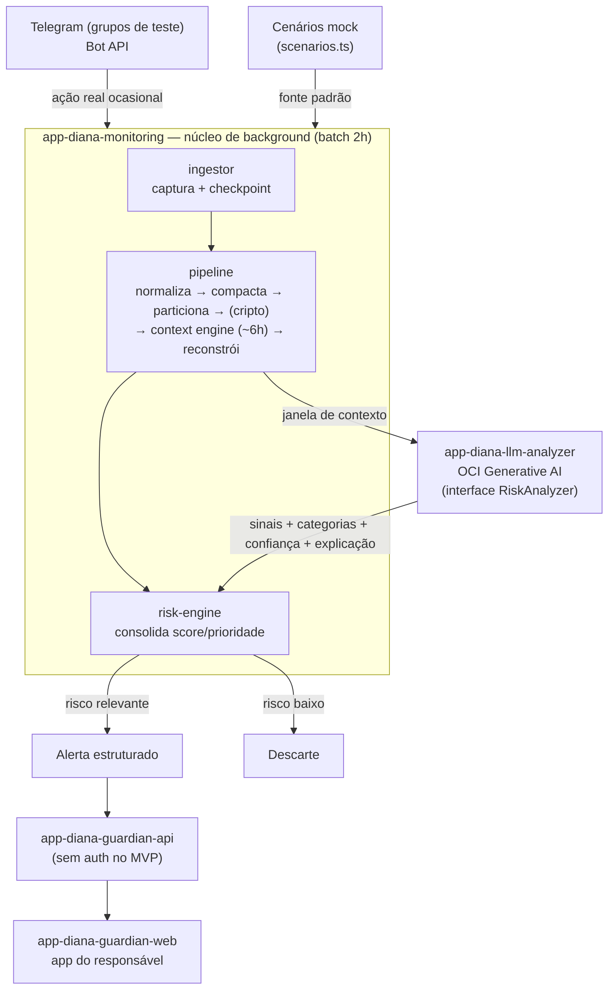

# DIANA — Documentação de Arquitetura (MVP)

> **Fonte única de documentação da DIANA.** Esta pasta `docs/` vive no repositório
> `app-diana-monitoring` e é **compartilhada e referenciada por todos os repositórios** do projeto
> (ver [como cada repo consome esta pasta](#como-os-repositórios-consomem-esta-pasta)).

Este conjunto de documentos traduz a **visão funcional** da DIANA
(`DIANA_Solution_Architecture_Functional_Vision.md`) em uma **divisão de repositórios** e um
**mapeamento para a Oracle Cloud (OCI)**, no formato de um **primeiro MVP simples**.

---

## O que é a DIANA (resumo de 30 segundos)

A DIANA é uma plataforma de proteção digital infantil que **analisa o contexto e a evolução de uma
conversa ao longo do tempo** — não mensagens isoladas — para identificar padrões associados a três
pilares de risco:

1. **Grooming / Aliciamento**
2. **Cyberbullying**
3. **Captura de informação pessoal**

O responsável **não recebe a conversa integral**: recebe um **alerta estruturado** (score, prioridade,
categorias, sinais, frequência, escalada, sequência, justificativa e recomendação). A DIANA é um
**mecanismo de apoio à decisão humana**, nunca um veredito automático.

---

## Postura deste MVP

Este é um **primeiro MVP deliberadamente simples**. As decisões que valem para toda a documentação:

| Tema | Decisão do MVP |
| --- | --- |
| Dados | **Majoritariamente MOCKADOS** (reaproveita o pipeline mock e os cenários da landing). **Ação real ocasional via Telegram** entra pelo mesmo fluxo. |
| Batch | Captura/processamento a cada **2 horas**. |
| Janela de contexto | **3 partições ≈ 6 horas** (configurável). |
| LLM | **OCI Generative AI** (serviço gerenciado), atrás da interface `RiskAnalyzer`. |
| Captura | **Telegram Bot API** em grupos/conversas de teste. |
| **Fora do MVP** | Observability, rede/VCN, autenticação/IAM, cache Redis, banco gerenciado, broker de eventos, KMS/cripto completa. Ver [roadmap](07-roadmap.md). |

---

## Mapa dos repositórios (5 no total)

| Repositório | Papel | Eixo |
| --- | --- | --- |
| [`app-diana-monitoring-lading-page`](https://github.com/Tech4Change-Diana/app-diana-monitoring-lading-page) | Landing + protótipo/demo interativo (mantém o mock) | — |
| **`app-diana-monitoring`** *(este repo)* | **Núcleo de background** (Telegram ingestor + pipeline + Risk Engine) **+ repo-plataforma** (esta pasta `docs/`) | Background |
| `app-diana-llm-analyzer` *(a criar)* | Inteligência: gateway **OCI Generative AI** + módulo **contracts** | LLM |
| `app-diana-guardian-api` *(a criar)* | API do responsável (sem auth no MVP) | Tela do responsável |
| `app-diana-guardian-web` *(a criar)* | App web mobile do responsável | Tela do responsável |

Detalhes e a análise das junções que reduziram 8 → 5 repos em [`01-repositorios.md`](01-repositorios.md).

---

## Índice

| Documento | Conteúdo |
| --- | --- |
| [`01-repositorios.md`](01-repositorios.md) | Divisão dos 5 repositórios, análise das junções, grafo de dependências, postura mock-first |
| [`02-pipeline-background.md`](02-pipeline-background.md) | O que roda em background: ingestor + pipeline, batch 2h, janela ~6h, máquina de estados |
| [`03-telegram-captura.md`](03-telegram-captura.md) | Comunicação com o Telegram: Bot API, checkpoint, normalização |
| [`04-llm-inteligencia.md`](04-llm-inteligencia.md) | Como a LLM funciona: OCI Generative AI, structured output, LLM × Risk Engine |
| [`05-experiencia-responsavel.md`](05-experiencia-responsavel.md) | Tela do responsável: web + API, o que recebe e o que não recebe |
| [`06-mapeamento-oci.md`](06-mapeamento-oci.md) | Mapeamento enxuto para serviços da OCI |
| [`07-roadmap.md`](07-roadmap.md) | Fases, rastreabilidade dos requisitos (RF-01…RF-16), o que fica para depois |
| [`contracts.md`](contracts.md) | Contrato de domínio compartilhado (`Conversation`, `AnalysisResult`, `RiskAnalyzer`) |

---

## Arquitetura em uma imagem

---

## Como os repositórios consomem esta pasta

Esta pasta `docs/` é a **fonte única de verdade** para arquitetura e contrato. Os demais repositórios
**não duplicam** a documentação — eles a referenciam:

- **Via link**: o `README.md` de cada repo aponta para
  `https://github.com/Tech4Change-Diana/app-diana-monitoring/tree/develop/docs`.
- **Opcional (git submodule)**: um repo pode incluir esta pasta como submódulo em `docs/` quando quiser
  a documentação presente localmente.
- **Contrato**: o **schema canônico** do contrato de domínio é descrito em [`contracts.md`](contracts.md).
  A implementação TypeScript vive no módulo `contracts/` de `app-diana-llm-analyzer`; qualquer divergência
  se resolve **a favor desta pasta**.

---

## Privacy by Design (nota curta)

A privacidade é um **princípio congelado do produto**, não um item opcional:

- o responsável recebe **evidências resumidas**, nunca a conversa integral;
- o dado bruto tem **menor retenção e maior proteção** (plaintext apenas efêmero, em memória, durante a análise);
- coleta-se o **mínimo necessário** para a finalidade.

Neste MVP, o **hardening completo** (criptografia forte com KMS, retenção formal, controle de acesso, auditoria
detalhada) é declarado como **"arquitetura preparada para requisitos de privacidade"** — projetado, porém ainda
não implementado. Ver [`07-roadmap.md`](07-roadmap.md). Esta documentação descreve produto e arquitetura e **não
substitui parecer jurídico** sobre LGPD / ECA Digital.
